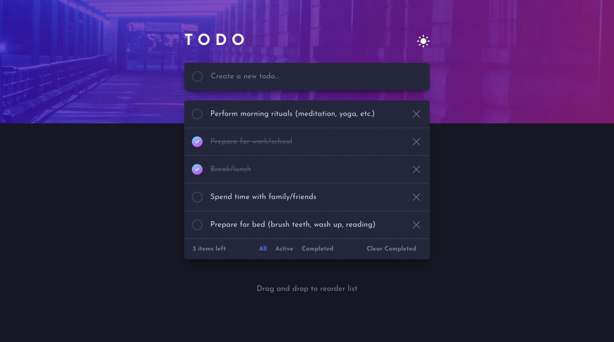

# Todo App

## Overview

This Todo App is a task management web application designed to streamline your daily workflow. With an intuitive interface and robust features, it offers a seamless experience for organizing tasks efficiently.

## Features

- **Task Management**: Add, mark, and delete tasks effortlessly.
- **Filtering**: Filter tasks by category - all tasks, active tasks, or completed tasks.
- **Light/Dark Mode**: Toggle between light and dark mode for personalized viewing.
- **Responsive Design**: Ensures optimal viewing experience across devices.
- **Drag-and-Drop**: Reorder tasks with ease using drag-and-drop functionality.

## Technologies Used

- React
- TailwindCSS
- framer-motion

## Contact
For any inquiries or feedback, please contact me at telegram using this username: @mohgad

Muhammad Gad
muhammadgadwork@gmail.com
